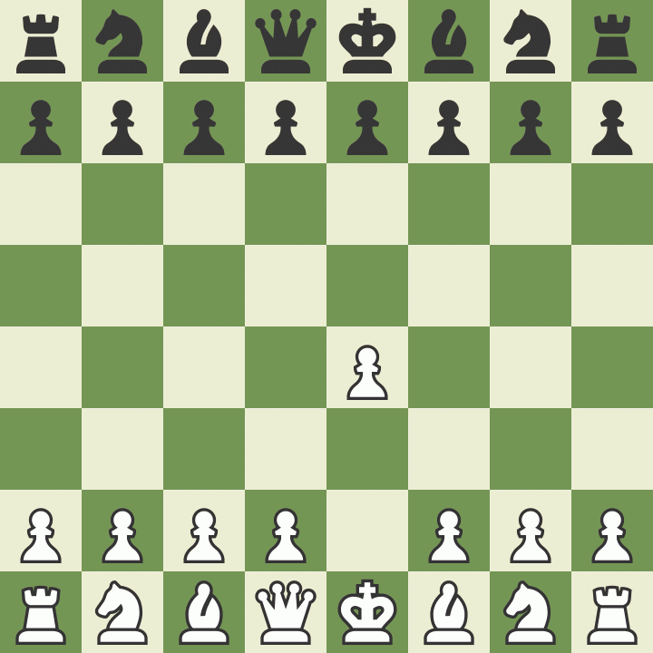

# Habu
Habu is a chess engine written in Python inspired by Sunfish. I recommend using [PyPy Just-In-Time intepreter](https://pypy.org/) for better performance.
It even manages to beat Fruit 2.1! (example is shown playing black pieces at 5+3 time control)

### Features

- Quiescense search with NNUE evaluation
- Iterative deepening with aspiration windows
- Fail-soft principal variation search
- Null move pruning
- Razoring
- Futility pruning
- Late move reductions
- Late move pruning
- Countermove history based pruning
- Check extensions
- Transposition table
- Move ordering with MVV-LVA, threat move, counter move, killer and history heuristics

## NNUE
Habu uses NNUE for evaluation. NNUE library needs to be compiled
```
cd nnue-probe/src
make
```

### Acknowledgements

Thanks to the authors of these projects

* [Sunfish](https://github.com/thomasahle/sunfish)
* [Chess Programming Wiki](https://www.chessprogramming.org/)
* [Cute Chess](https://github.com/cutechess/cutechess)
* [nnue-probe](https://github.com/dshawul/nnue-probe)
* [Stockfish](https://github.com/official-stockfish/Stockfish/)
* [Xiphos](https://github.com/milostatarevic/xiphos)
